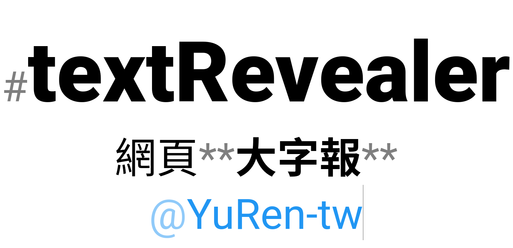

# textRevealer


textRevealer is a tool to display some text.

*Read this in other languages: [English](README.md), [正體中文](README.zh-Hant-TW.md)*

## Features
### Styling the text
Wrap text by the marks listed below to style the text.

| mark             | opening | closing | style        |
| ---------------- | :-----: | :-----: | ------------ |
| asterisk         | `*`     | `*`     | italic       |
| asterisk × 2     | `**`    | `**`    | bold         |
| asterisk × 3     | `***`   | `***`   | bold italic  |
| double quote     | `"`     | `"`     | serif        |
| grave            | `` ` `` | `` ` `` | monospace    |
| underscore × 2   | `__`    | `__`    | underline    |
| hyphen × 2       | `--`    | `--`    | line-through |
| tilde × 2        | `~~`    | `~~`    | line-through |
| CJK quote        | `「`    | `」`    | serif        |
| CJK double quote | `『`    | `』`    | serif        |

Or add the marks listed below in front of words.

| mark            | leading | style                 |
| --------------- | :-----: | --------------------- |
| number sign     | `#`     | 2x size, weight 900   |
| number sign × 2 | `##`    | 1.5x size, weight 700 |
| at sign         | `@`     | blue text             |
| caret           | `^`     | superscript           |

> At sign `@` and caret `^` can also be closed by a space.

### Switching the writing direction
Press `Tab` key to switch the writing direction between horizontal and vertical (vertical-RL).


## Customization
### Changing the style
Change the CSS of the HTML classes to customize the style.

Those HTML class names are in the form of:

* Wrapped text: `-name`
* Opening symbol: `-name-start`
* Closing symbol: `-name-end`
* Leading symbol: `-name-start`
* Line break (or space) after a leading symbol: `-name-end`

Where the `-name` is the HTML class name of each mark.

Here are the HTML class names of the default marks:

| mark             | opening | closing | HTML class name |
| ---------------- | :-----: | :-----: | --------------- |
| asterisk         | `*`     | `*`     | `-ast`          |
| asterisk × 2     | `**`    | `**`    | `-ast2`         |
| asterisk × 3     | `***`   | `***`   | `-ast3`         |
| double quote     | `"`     | `"`     | `-dblq`         |
| grave            | `` ` `` | `` ` `` | `-grave`        |
| underscore × 2   | `__`    | `__`    | `-under`        |
| hyphen × 2       | `--`    | `--`    | `-hyphen`       |
| tilde × 2        | `~~`    | `~~`    | `-tilde`        |
| parenthesis      | `(`     | `)`     | `-paren`        |
| bracket          | `[`     | `]`     | `-bracket`      |
| braces           | `{`     | `}`     | `-braces`       |
| angle            | `<`     | `>`     | `-angle`        |
| CJK quote        | `「`    | `」`    | `-cjkq`         |
| CJK double quote | `『`    | `』`    | `-cjkdq`        |
| number sign      | `#`     |         | `-numsign`      |
| number sign × 2  | `##`    |         | `-numsign2`     |
| at sign          | `@`     |         | `-at`           |
| caret            | `^`     |         | `-caret`        |

### Changing the marks and symbols
Use the JavaScript methods listed below to customize the marks and symbols.

#### 1. `addMarkOnly(mark, symbol)`
  - Add a new mark into the textMarker parser.
  - **mark** (_String_) - HTML class name of the mark.
  - **symbol** (_String_) - The symbol.

#### 2. `addMarkBetween(mark, opening, closing)`
  - Add a new mark into the textMarker parser.
  - **mark** (_String_) - HTML class name of the mark.
  - **opening** (_String_) - The opening symbol.
  - **closing** (_String_) - The closing symbol.
    - default: `undefined`, will be the same as **opening**.

#### 3. `addMarkAfter(mark, leading, closedBySpace)`
  - Add a new mark into the textMarker parser.
  - **mark** (_String_) - HTML class name of the mark.
  - **leading** (_String_) - The leading symbol.
  - **closedBySpace** _(Bool)_ - This mark can also be closed by a space.
    - default: `false`, this mark can only be closed by a line break.

#### 4. `setSymbolView(symbol, view)`
  - Set the view of a symbol.
  - **symbol** (_String_) - The symbol which people key in.
  - **view** (_String_) - The symbol which people will see.

For example, to add a mark where the text is in between `«` and `»`, we need add one line of JS code (after the reference of `textRevealer.js`) like:

```HTML
<script src="./textMarker.js"></script>
<script src="./textPacker.js"></script>
<script src="./textRevealer.js"></script>
<script>
  addMarkBetween('-guillemet', '«', '»');
</script>
```

